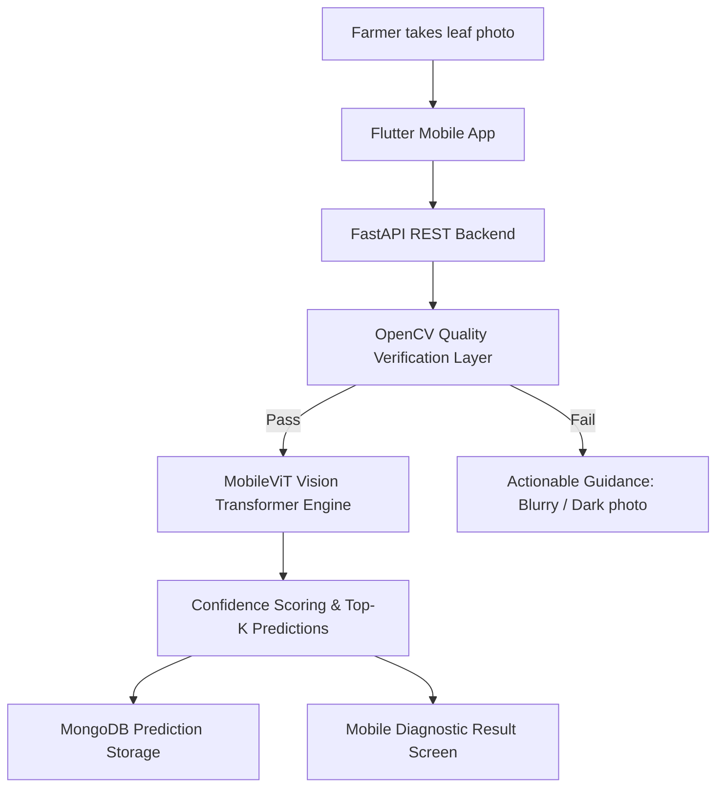

# 🌱 SmartCrop AI — Intelligent Crop Disease Diagnosis & Farmer Advisory System

> **Empowering farmers with instant, accessible, AI-driven plant disease diagnosis and intelligent crop health guidance.**

[](https://www.python.org/)
[](https://pytorch.org/)
[](https://fastapi.tiangolo.com/)
[](https://flutter.dev/)
[](https://opencv.org/)
[](LICENSE)

---

## 📌 Project Overview

**SmartCrop AI** is an end-to-end smart agricultural mobile platform designed to bridge the gap between smallholder farmers and modern agricultural expertise. 

Crop diseases cause substantial economic and yield losses worldwide. Due to the scarcity of field agronomists in rural areas and the technical complexity of typical diagnostic tools, farmers often struggle with early detection. SmartCrop AI solves this by allowing farmers to simply take a photo of an affected leaf using their smartphone and receive an **instant, highly accurate diagnosis** paired with actionable, farmer-friendly confidence guidance.

---

## ✨ Key Features

- 🌿 **Lightweight Vision Transformer (MobileViT):** Combines convolution and multi-head self-attention to capture local leaf lesions and global leaf morphology while maintaining a lightweight footprint (<12 MB) optimized for mobile edge deployment.
- 🔍 **Automated Image Quality Assurance (OpenCV):** Pre-evaluates incoming field photos for blur (Laplacian variance), illumination extremes (too dark / over-exposed), and resolution thresholds before passing to neural inference.
- 📱 **Farmer-Centric Mobile Experience (Flutter Material 3):** Crafted with a soothing **"Nature + AI + Simplicity"** design system featuring 9 functional screens, smooth page transitions, and clear color-coded confidence indicators (e.g., *"AI Confidence: 96% — High"*).
- ⚡ **High-Throughput REST API (FastAPI):** Asynchronous microservice backend with automatic OpenAPI/Swagger documentation, multipart upload handling, and MongoDB persistence.
- 🎯 **Multi-Crop Disease Identification:** Trained and validated across 20 distinct disease classes spanning multiple staple crops.

---

## 🏗️ System Architecture



### Complete End-to-End Pipeline
```
Farmer -> Select Crop -> Camera/Gallery -> OpenCV Quality Filter -> MobileViT AI Analysis -> Diagnosis & Confidence
```

---

## 🌿 Supported Crops & Disease Classes

The model is trained on **15,011 field images** across 20 specialized classes:

| Crop | Classes Supported |
|---|---|
| 🍌 **Banana** | Bract Mosaic Virus, Cordana, Healthy, Insect Pest, Moko, Panama Disease, Pestalotiopsis, Sigatoka, Yellow Sigatoka |
| 🥜 **Groundnut** | Early Leaf Spot, Early Rust, Healthy, Late Leaf Spot, Nutrition Deficiency, Rust |
| 🥬 **Radish** | Black Leaf Spot, Downy Mildew, Flea Beetle, Healthy, Mosaic Virus |

---

## 📊 Model Performance & Evaluation

Evaluated against **2,260 unseen held-out test images**:

- **Overall Test Accuracy:** **88.27%**
- **Weighted Precision:** **90.31%**
- **Weighted Recall:** **88.27%**
- **Weighted F1-Score:** **0.8838**

### Per-Crop Performance Highlights

| Disease Class | Precision | Recall | F1-Score |
|---|---|---|---|
| **Radish (All 5 Classes)** | **100.0%** | **100.0%** | **1.0000** |
| **Banana Cordana** | **100.0%** | **100.0%** | **1.0000** |
| **Banana Moko** | **100.0%** | **98.0%** | **0.9901** |
| **Groundnut Nutrition Deficiency** | **99.4%** | **97.8%** | **0.9860** |
| **Groundnut Early Rust** | **92.2%** | **100.0%** | **0.9593** |
| **Groundnut Healthy** | **96.2%** | **100.0%** | **0.9804** |
| **Banana Healthy** | **94.6%** | **97.2%** | **0.9589** |

*Visual charts and complete metrics are available in [`docs/`](docs/):*
- [Confusion Matrix Heatmap](docs/confusion_matrix.png)
- [Training Loss & Accuracy Curves](docs/training_curves.png)
- [Class Distribution Visualization](docs/class_distribution.png)
- [Detailed Classification Report](docs/training_report.md)

---

## 🛠️ Technology Stack

| Layer | Technologies Used |
|---|---|
| **Mobile Frontend** | Flutter, Dart, Material 3, Google Fonts (Outfit & Inter), Image Picker |
| **AI / Machine Learning** | PyTorch, `timm` (MobileViT), torchvision, scikit-learn |
| **Computer Vision** | OpenCV (Laplacian variance, RGB-to-Grayscale luminance), Pillow |
| **Backend API** | FastAPI, Uvicorn, Pydantic, Python-Multipart |
| **Database** | MongoDB (via Motor async driver) |
| **Data Visualization** | Matplotlib, Seaborn |

---

## 📁 Repository Structure

```
smart_crop_AI/
│
├── ai_model/               # AI & Deep Learning Core
│   ├── config.py           # Model & training hyperparameters
│   ├── dataset.py          # Stratified train/val/test splitting pipeline
│   ├── preprocessing.py    # Image augmentation & normalization
│   ├── train.py            # Model training with class-weighted loss
│   ├── evaluate.py         # Test evaluation & confusion matrix generator
│   ├── inference.py        # Single-image prediction engine
│   ├── model_service.py    # Singleton model inference loader
│   └── class_names.json    # 20 target disease class labels
│
├── backend/                # FastAPI REST Server
│   ├── app/
│   │   ├── main.py         # Application entry point & CORS
│   │   ├── config.py       # Server & threshold configurations
│   │   ├── routes/         # API routes (/health, /verify-image, /predict)
│   │   ├── services/       # Image verification, OpenCV & model services
│   │   └── schemas/        # Pydantic request/response models
│   ├── requirements.txt    # Python backend dependencies
│   └── .env.example        # Environment variable template
│
├── mobile/                 # Flutter Mobile Application
│   ├── lib/
│   │   ├── main.dart       # App entry point with custom transition routing
│   │   ├── screens/        # 9 functional screens (Splash, Home, Scan, Result, etc.)
│   │   ├── widgets/        # Reusable UI components (ConfidenceBadge, CropCard, etc.)
│   │   ├── theme/          # Nature + AI design system (Colors, Spacing, Typography)
│   │   ├── models/         # Dart data models
│   │   └── services/       # HTTP API communication client
│   └── pubspec.yaml        # Flutter package dependencies
│
└── docs/                   # Documentation, Charts & Reports
    ├── confusion_matrix.png
    ├── training_curves.png
    ├── class_distribution.png
    └── MILESTONE_30_PERCENT_SUBMISSION.md
```

---

## 🚀 Getting Started & Local Setup

### 1. Prerequisites
- Python 3.11+
- Flutter 3.38+
- Android Studio / VS Code

### 2. Backend Setup
```bash
# Navigate to backend directory
cd backend

# Install dependencies
pip install -r requirements.txt

# Start the FastAPI server
python -m uvicorn app.main:app --reload --host 0.0.0.0 --port 8000
```
*Access interactive Swagger API documentation at: `http://localhost:8000/docs`*

### 3. Mobile App Setup
```bash
# Navigate to mobile directory
cd mobile

# Get Flutter packages
flutter pub get

# Launch on connected device / emulator
flutter run
```

### 4. Running AI Evaluation / Inference
```bash
# Run full evaluation on test set:
python ai_model/evaluate.py

# Run prediction on a single leaf image:
python ai_model/inference.py "path/to/leaf_image.jpg"
```

---

## 🗺️ Roadmap & Future Enhancements

- [x] Multi-crop dataset preprocessing and stratified splitting (Banana, Groundnut, Radish)
- [x] Lightweight MobileViT vision transformer model training
- [x] Real-time OpenCV image blur and brightness quality validator
- [x] RESTful API backend with async inference and prediction logging
- [x] Complete 9-screen Flutter mobile application with Material 3 design
- [ ] Disease severity estimation and progression grading
- [ ] Localized organic & chemical treatment advisory recommendations
- [ ] Regional weather integration for disease outbreak risk alerts
- [ ] Multilingual voice assistant (TTS) for regional language support

---

## 📄 License & Attribution

This project is developed as an academic final-year capstone project.  
Licensed under the [MIT License](LICENSE).
