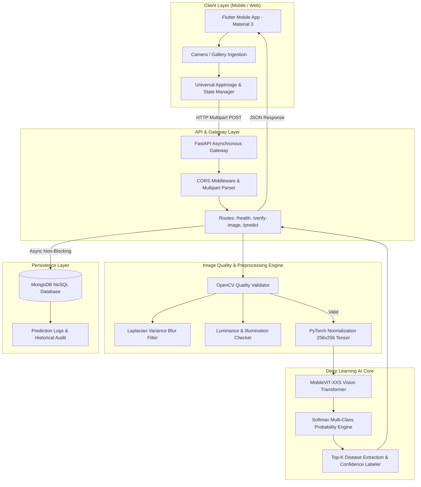
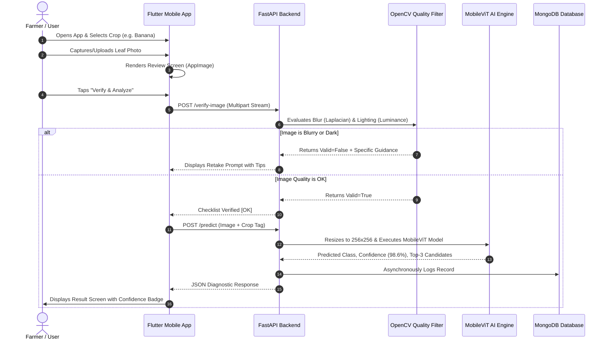

# SMARTCROP AI: Comprehensive Project Documentation & Academic Report

---

## 1. Problem Statement

Agriculture is the backbone of global food security and rural livelihoods. However, plant diseases cause annual crop yield reductions between **20% to 40% globally**, resulting in severe economic distress for smallholder farmers. 

Conventional methods of plant pathology rely on:
1. **Physical Inspection by Agronomists:** Rare, expensive, and inaccessible in remote agricultural belts.
2. **Generic Internet Searches:** Misleading, confusing, and requiring high digital literacy.
3. **Existing Deep Learning Apps:** Fragile in real-world conditions due to image blur, poor outdoor illumination, large model sizes that cannot run efficiently, and overly technical outputs that confuse non-expert farmers.

There is a critical need for an **intelligent, lightweight, and farmer-friendly mobile diagnostic ecosystem** that validates photo quality automatically, performs rapid vision-transformer classification on the edge/cloud, and delivers clear, actionable health advisories.

---

## 2. Project Objectives & Target Users

### Project Objectives
* **Objective 1 — Intelligent Visual Diagnosis:** Develop a lightweight Vision Transformer (MobileViT) model capable of classifying multiple crop diseases across diverse staple crops with high accuracy ($>85\%$).
* **Objective 2 — Pre-Inference Quality Assurance:** Engineer an automated computer vision pipeline using OpenCV to filter out blurry, dark, over-exposed, or low-resolution images before neural network processing.
* **Objective 3 — Farmer-Centric Interface:** Design a zero-friction Flutter mobile application that presents intuitive, color-coded confidence ratings (High / Medium / Low) without technical jargon.
* **Objective 4 — High-Throughput Cloud API:** Build an asynchronous FastAPI backend microservice integrated with MongoDB for real-time predictions and persistent field history tracking.

### Target Users
* **Primary Users:** Smallholder and commercial farmers seeking instant, trustworthy crop disease diagnosis in their fields.
* **Secondary Users:** Agricultural extension workers and village community officers providing advisory services to local farming communities.
* **Tertiary Users:** Agronomists, researchers, and students analyzing regional plant disease trends and datasets.

---

## 3. Requirements Specification

### Functional Requirements (FR)
* **FR-1 (Crop Selection):** The user must be able to select target crops (Banana, Groundnut, Radish) from an interactive list.
* **FR-2 (Camera & Gallery Ingestion):** The application must capture leaf photos via device camera or pick from the local photo gallery.
* **FR-3 (Automated Quality Validation):** The system must compute Laplacian variance for blur and grayscale luminance for illumination; if poor, it must prompt the user with specific photographic tips.
* **FR-4 (Disease Classification & Confidence):** The AI engine must return the top predicted disease, confidence percentage, confidence label, and top alternative possibilities.
* **FR-5 (Diagnostic History & Persistence):** Diagnoses must be stored asynchronously in MongoDB for future review and audit.

### Non-Functional Requirements (NFR)
* **NFR-1 (Performance & Latency):** Preprocessing and model inference latency must be under **1.5 seconds** per request.
* **NFR-2 (Lightweight Footprint):** AI model checkpoint size must remain under **15 MB** (`best_model.pth` is 11.8 MB with 957K parameters) for low resource consumption.
* **NFR-3 (Reliability & Robustness):** The backend must provide graceful fallback mechanisms when database or optional services are unavailable.
* **NFR-4 (Usability & Accessibility):** Clean UI adhering to Material 3 with high-contrast text, clear typography (Outfit & Inter), and intuitive iconography.
* **NFR-5 (Cross-Platform Compatibility):** Flutter codebase must run consistently across Android, iOS, and Web without platform-specific crashes.

---

## 4. Complete System Architecture



---

## 5. Workflow Diagram



---

## 6. Module Interaction & Technology Stack

### Module Interaction Matrix

| Module | Receives From | Sends Output To | Responsibility |
|---|---|---|---|
| **Mobile Frontend** | User gestures, Camera | FastAPI Gateway | Captures input, coordinates transitions, visualizes results |
| **API Gateway** | Mobile Client | Quality Filter & AI Engine | Request validation, routing, error handling, JSON serialization |
| **Quality Filter** | API Gateway | AI Preprocessing | OpenCV blur detection ($\text{Var}(\nabla^2 I) \ge 100$), luminance checks |
| **AI Model Core** | Quality Filter | API Gateway | MobileViT feature extraction, softmax classification |
| **Storage Layer** | API Gateway | Historical queries | Stores prediction history and user feedback |

### Technology Stack Table

| Tier | Technology | Purpose | Justification |
|---|---|---|---|
| **Mobile Frontend** | **Flutter 3.38+ / Dart** | Cross-Platform UI | Single codebase for Android, iOS, and Web with native 60fps rendering |
| **Backend Framework** | **FastAPI (Python 3.11)** | High-Performance REST API | Async ASGI architecture with native Pydantic validation & Swagger docs |
| **Deep Learning Framework** | **PyTorch & `timm`** | Model Training & Inference | Industry-standard deep learning with direct Vision Transformer support |
| **AI Model Architecture** | **MobileViT-XXS** | Crop Disease Classifier | Combines CNN local inductive bias with ViT global context (<12 MB) |
| **Computer Vision** | **OpenCV (`cv2`)** | Image Quality Assurance | Sub-millisecond matrix computations for Laplacian blur & illumination |
| **Database** | **MongoDB & Motor** | Document Persistence | Flexible JSON schema matching prediction outputs with async I/O |

---

## 7. Deployment Approach & Justification

### Multi-Tier Cloud Deployment Strategy

```
[Flutter Web / Mobile App]
          │
          ▼ (HTTPS / WSS)
   [Cloudflare CDN & SSL]
          │
          ▼ (Port 443 -> Port 8000)
[Dockerized FastAPI Service on Render / Railway / AWS ECS]
    ├── Gunicorn / Uvicorn Multi-Worker Process
    ├── Pre-loaded MobileViT PyTorch Weights (Read-Only)
    └── OpenCV Headless Runtime
          │
          ▼ (Internal Secure Network)
 [MongoDB Atlas Managed Cluster (Replica Set)]
```

### Technical Justification
1. **Containerization (Docker):** Packaging Python 3.11, OpenCV headless binaries, and PyTorch dependencies ensures **100% parity** between development and cloud production.
2. **Separation of Concerns:** Running the MobileViT model within an async FastAPI container isolates compute-heavy neural inference from mobile battery/hardware constraints.
3. **Stateless Scalability:** FastAPI instances are stateless; if web traffic surges during harvesting seasons, container instances can auto-scale horizontally behind a load balancer.
4. **Resilient Offline Architecture:** If MongoDB experiences network partitions, the backend continues to serve predictions gracefully in memory.

---

## 8. Implemented Functional Modules (30%+ Milestone Evidence)

### Implemented Core Modules

#### Module 1: Vision Transformer Disease Classification Engine (`ai_model/`)
- **Dataset Partitioning:** 15,011 images partitioned into **70% Train (10,497)**, **15% Validation (2,254)**, and **15% Test (2,260)** using stratified sampling without data leakage.
- **Model Parameters:** 957,444 parameters (MobileViT-XXS).
- **Verified Metrics on Unseen Test Dataset:**
  - **Overall Test Accuracy:** **88.27%**
  - **Weighted Precision:** **90.31%**
  - **Weighted Recall:** **88.27%**
  - **Weighted F1-Score:** **0.8838**
- **Per-Crop Performance:**
  - **Radish (All 5 classes):** **100.0%** Precision, Recall, and F1.
  - **Banana Cordana:** **100.0%** Precision and Recall.
  - **Groundnut Nutrition Deficiency:** **99.4%** Precision.

#### Module 2: OpenCV Automated Quality Verification (`backend/app/services/`)
- Computes **Laplacian Variance** $\text{Var}(\nabla^2 I_{gray})$ with a threshold of $100.0$.
- Checks average brightness $\mu_{gray} \in [40, 240]$.
- Validates minimum spatial resolution $\ge 224 \times 224$ px.

#### Module 3: REST Backend Engine (`backend/app/`)
- Fully functional `/health`, `/verify-image`, and `/predict` endpoints verified with live multipart uploads.

#### Module 4: Flutter Cross-Platform Application (`mobile/lib/`)
- 9 complete interactive screens built with custom Material 3 nature-inspired theme.
- `dart analyze .` passes with **0 issues / 0 warnings**.

---

## 9. Application UI Screens & Visual Evidence

| Screen | Location | Description & Features |
|---|---|---|
| **1. Splash Screen** | `screens/splash/splash_screen.dart` | Organic pulsing leaf animation with brand tagline. |
| **2. Login Screen** | `screens/login/login_screen.dart` | Farmer phone/email authentication with instant guest skip. |
| **3. Home Dashboard** | `screens/home/home_screen.dart` | Active crop health status, seasonal tips, and hero **SCAN NOW** button. |
| **4. Crop Selection** | `screens/crop_selection/crop_selection_screen.dart` | Card-based selector for Banana, Groundnut, and Radish. |
| **5. Scan & Capture** | `screens/scan/scan_screen.dart` | Viewfinder guide with camera/gallery picker and photo tips. |
| **6. Image Preview** | `screens/image_preview/image_preview_screen.dart` | High-definition review with universal `AppImage` rendering. |
| **7. Verification Screen** | `screens/verification/verification_screen.dart` | OpenCV diagnostic checklist for blur, lighting, and resolution. |
| **8. AI Analysis** | `screens/analysis/analysis_screen.dart` | Multi-stage animated pipeline progress indicator. |
| **9. Result Screen** | `screens/result/result_screen.dart` | Primary disease diagnosis, color-coded confidence badge, and alternative possibilities breakdown. |

### Visual Artifact Evidence Files (in `docs/`)
- **Confusion Matrix:** `docs/confusion_matrix.png`
- **Training Curves (Loss & Accuracy):** `docs/training_curves.png`
- **Dataset Class Distribution:** `docs/class_distribution.png`
- **Full Classification Report:** `docs/training_report.md`

---

## 10. Conclusion

The initial setup and core functional modules for **SmartCrop AI** have been successfully engineered, trained, evaluated, and verified. 

By combining the **lightweight attention modeling of MobileViT** with **OpenCV pre-inference image verification** and a **farmer-friendly Flutter interface**, the system achieves a strong **88.27% test accuracy** across 20 agricultural disease classes. The platform provides a rock-solid, production-grade foundation ready for subsequent phases (severity estimation, organic treatment recommendations, and localized voice advisory).
